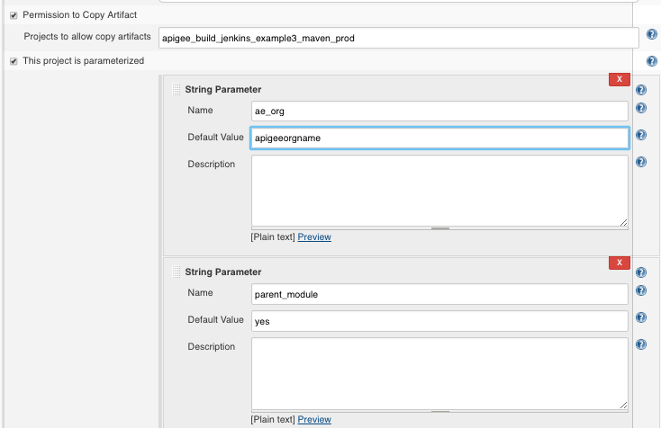
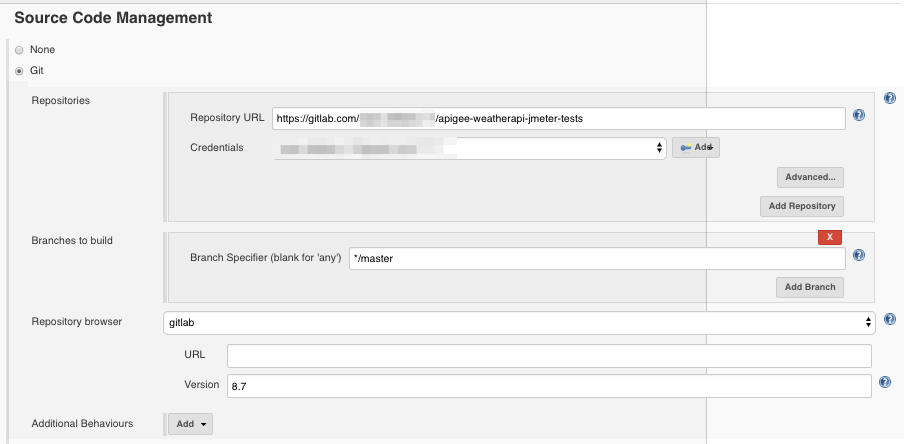
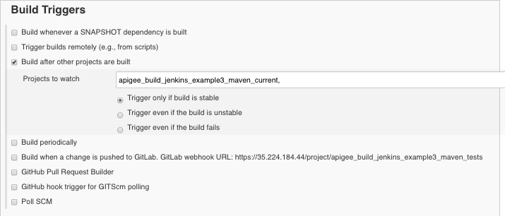
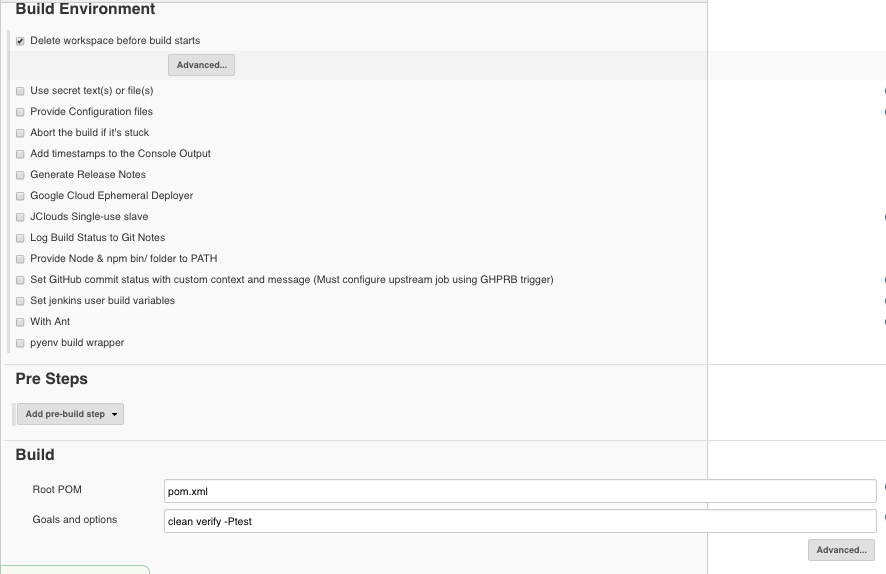
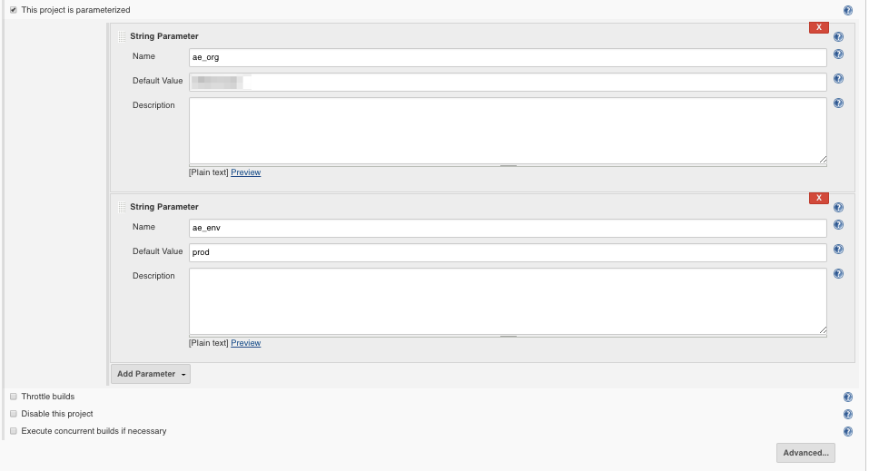
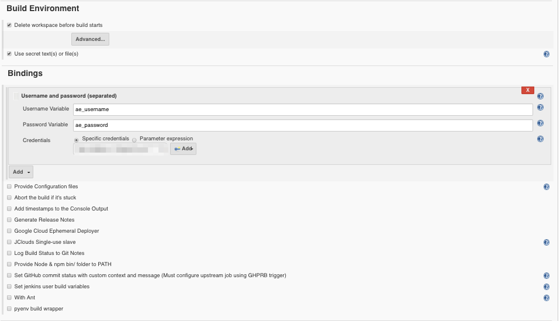
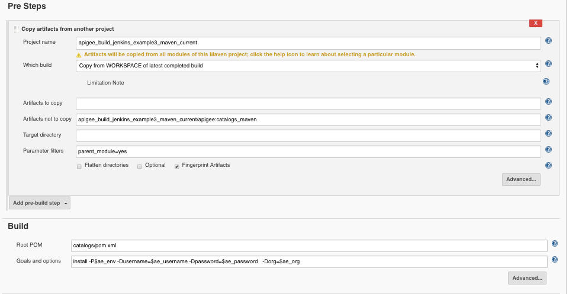
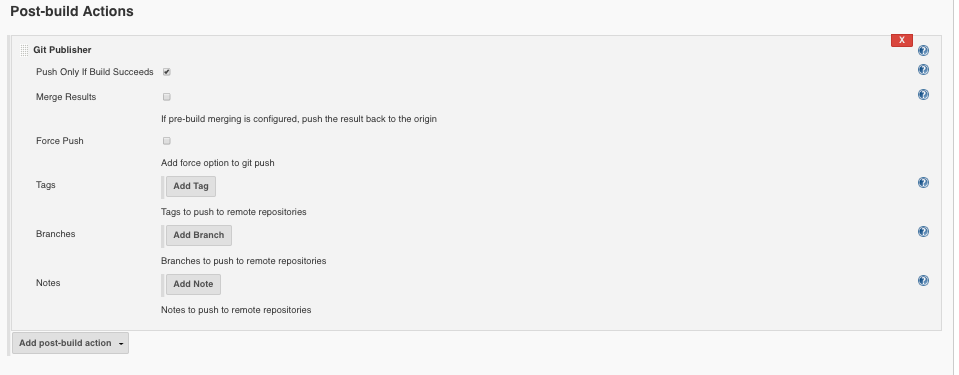

# apigee_build_jenkins_example3_maven

# Summary
This repository demonstrates how to configure Jenkins to deploy Apigee Edge proxies and execute tests.  

There are two sections:
1. Jenkins Build Triggered Manually
2. Jenkins Build Triggered from Github commit hook

# Jenkins Build Triggered Manually
This section describes how to configure Jenkins so that it will
* deploy the Apigee Edge proxy located in the catalogs folder to the test environment
* execute JMeter tests located in another repository
  * Sample JMeter tests are actually located in the `catalogs/tests` folder.
* deploy the same proxy to the prod environment
  * It should be noted that this will create a new revision in Apigee Edge in the prod environment; it will not deploy the same proxy revision in test to prod. This would require a slightly different setup.

## Jenkins Jobs Summary
There are three Jenkins Jobs and all three are maven jobs.

1. `apigee_build_jenkins_example3_maven_current`
  * This job must be executed manually.  
  * It clones the repository, builds the Apigee Proxy bungle and deploys it to Apigee Edge.  
2. `apigee_build_jenkins_example3_maven_tests`
  * This is executed only if the first job executes successfully.
  * It executes the JMeter tests against the test environment and publishes the results.
3. `apigee_build_jenkins_example3_maven_prod`
  * This job is executed only if the previous job executes successfully.
  * It copies the workspace from the first job and uses that to deploy the proxy to the prod environment.  
  * The reason for this is to ensure that we are using the same proxy bundle that was tested against in the first job.  If we pulled the repository again, then we run the risk that a commit could have been executed against the repository (so the repo may have changed).  This ensures the proxy deployed to test and prod are the same.  

Why have the second build?  The reason is that JMeter needs some configuration before we can execute the tests, and I didn't have time to complete the customization of it so that my Apigee Edge domain name is not stored in a public repo.  

## apigee_build_jenkins_example3_maven_current

This is a maven build job.

* Grants permission to another job to copy artifacts.
* Parameters are:
  * apigee org name
  * parent module = yes - TODO Why did I do this?

* Using Git to pull the repo and pulls from the master branch only.

* No build triggers because you have to trigger this job manually.

* The build environment is set to delete the workspace first and use a secret text file for the Apigee Edge org admin username and password for the Maven deployment command.

* No Presteps
* Build
  * Root POM: `catalogs/pom.xml`
  * Goals and options: `install -Ptest -Dusername=$ae_username -Dpassword=$ae_password   -Dorg=$ae_org`
* Postbuild Action is to archive the Apigee Edge zip file.

## apigee_build_jenkins_example3_maven_tests
This job executes the JMeter tests against the proxy deployed to the test environment.

* The source code is stored in a private Gitlab repository.

* This project is only built if the first job succeeds.

* Delete the current workspace before building.
* Build
  * Root POM: `pom.xml`
  * Goals and options: `clean verify -Ptest`

* Public the performance report.
  * Source data files: `**/*.jtl`
  * Select Mode: `Error Threshold` which means that the build will be marked as unstable when 1% of the test failed and the build will fail when 1% of the tests fail.  

## project apigee_build_jenkins_example3_maven_prod
This job builds the Apigee bundle and deploys to the prod environment.

* The Apigee Edge org and environment are build parameters.

* There is no source control for this project, because it uses the workspace from the first build.  This ensures that the source code has not changed between builds.
* Build Triggers
  * This job is executed only if the job that executes the JMeter tests succeeds.

* Delete the workspace and use a secret text file for the Apigee org admin and password that are passed to the Apigee Maven build command.

* Presteps
  * copies workspace from first job that executed successfully.
  * Artifacts not to copy: `apigee_build_jenkins_example3_maven_current/apigee:catalogs_maven`
    * This is an attempt to avoid copying the submodule that gets created, but it still copies it.
* Build
  * Root POM: `catalogs/pom.xml`
  * Goals and options: `install -P$ae_env -Dusername=$ae_username -Dpassword=$ae_password   -Dorg=$ae_org`
    * notice this deploys to the prod envrionment and it will deploy a new revision to prod with the same code.

* Final step is to push the code back to Github. The only reason for this is it uses branches.  This demo does not use branches and merge commits so there is no need to merge the code back to the remote repository.

## TODOS
1. Update JMeter test scripts so that configuration can be passed from the command line.
2. Update the second job to pass config via the command line and use the tests in this repository instead of a Gitlab repo.

# Scratch Pad
Tests Jenkins post-commit hook to my public openshift-jenkins application.

Testing post commit hook5\  
